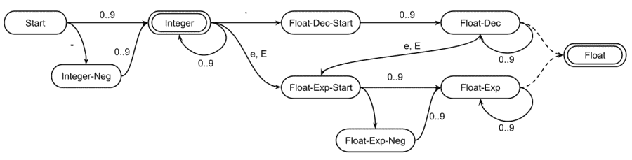

# Tokenizer

Tokenizers are build out of states and character sets to transition between states.
The states can be assigned tokens or be consumed.

```Plain
> (Start);
(Start): ^'"' => (inString): !'"' => (inString): ^'"' => [String];
(Start): '+' => [Concatenate];
(Start): '=' => [Assignment];
(Start): 'a'..'z', 'A'..'Z', '_' => (Identifier): 'a'..'z', 'A'..'Z', '_', '0'..'9' => [Identifier];
(Start): ' \n\r\t' => ^[Whitespace];
```

Since tokenizers are state machines it is recommended you create
a diagram of any part of the tokenizer which is complicated to help.


- [Start State](#start_state)
- [Character Transition](#character_transition)
  - [Transition Range](#transition_range)
  - [Transition Set](#transition_set)
  - [Transition Not Characters](#transition_not_characters)
  - [Transition On Any Character](#transition_on_any_character)
  - [Transition Combining](#transition_combining)
  - [Special Transition Characters](#special_transition_characters)
  - [Consuming Characters](#consuming_characters)
- [Chaining States](#chaining_states)
- [Assigning Tokens](#assigning_tokens)
  - [Consuming Tokens](#consuming_tokens)
  - [Replacing Tokens](#replacing_tokens)
- [Examples](#examples)
  - [Integers and Floats](#integers_and_floats)
  - [Binary, Octal, Decimal, and Hexadecimal](#binary_octal_decimal_and_hexadecimal)
  - [Symbols](#symbols)
  - [Reserved Identifiers](#reserved_identifiers)

## Start State

To set the state which the tokenizer starts at use the following.
Only one start should be indicated. If more than one is indicated
then the last defined one will be used as the start.

```Plain
> (Start);
```

## Character Transition

There are several ways to set a tokenizer transition between two states.
The states may be the same to create a loop for repeat transitions.
The transition occurs when a specified character is matched.
If there are duplicate state and character combinations the first defined transition will be taken.

This is a state transition on a single character.

```Plain
(State): '0' => (Next);
(State): '1' => (Next);
(Next):  '1' => (Next);
```

### Transition Range

This is a state transition on a range.
All characters between and including the start and stop characters (by Unicode value).

```Plain
(State): '0'..'9' => (Next);
```

### Transition Set

The transition can also be defined by a set of characters.
All the individual characters in the set will transition
from the start to the end state. Repeats are ignored.

```Plain
(State): 'abcd' => (Next);
```

### Transition Not Characters

All or part of a transaction can be negated.
The NOT will match everything except for the values in the set and ranges.

```Plain
(State): !'abcd'   => (Next);
(State): !'a'..'d' => (Next);
```

### Transition On Any Character

A transition can also match any character.
Since the characters are matched in the order they are
defined, this can be used like an "else" or "otherwise".

```Plain
(State): * => (Next);
```

### Transition Combining

Several transitions between the same two states can be OR'ed together
by listing them and comma separating them.

```Plain
(State): 'a'..'z', 'A'..'Z' => (Next);
```

Negations only apply to the set or range it is next to.
The following will match anything that is not a lowercase letter and it matches lower case 'g'.

```Plain
(State): !'a'..'z', 'g' => (Next);
```

Negations can be combined negations with parenthesis.

```Plain
(State): !('a'..'z', 'A'..'Z', '_') => (Next);
```

### Special Transition Characters

The transitions can use either single quotes or double quotes.

```Plain
(State): "abcd" => (Next);
(State): "'"    => (Next);
(State): '"'    => (Next);
```

The characters can be defined as Unicode characters (no modifiers).
The characters can be escaped to specify specific characters.
See the below table for the list of single character escapes.

| Notation | ASCII | character Description |
|:--------:|:-----:|:----------------------|
| \\'      | \\x27 | allow to enter a '    |
| \\"      | \\x22 | allow to enter a "    |
| \\\\     | \\x5c | allow to enter a \    |
| \\b      | \\x08 | back-space            |
| \\f      | \\x0c | form-feed (new page)  |
| \\n      | \\x0a | line-feed (new line)  |
| \\r      | \\x0d | carriage-return       |
| \\t      | \\x09 | tab (horizontal-tab)  |
| \\v      | \\x0b | vertical-tab          |

Apostrophes do not need to be escaped when inside quotes and
quotation marks do not need to be escaped when inside single quotes.

Additionally, the character can be an ASCII byte in hexadecimal (\\xFF) or a UTF-16 hexadecimal (\\uFFFF).

```Plain
(State): '\''     => (Next);
(State): "\""     => (Next);
(State): '\n\r'   => (Next);
(State): '\x0A'   => (Next);
(State): '\u2042' => (Next);
```

### Consuming Characters

A transition can be consumed and not outputted into the token result.
Add a hat (`^`) in the front of the transition to consume the letter that was matched.
The consume will apply to all comma separated sets and ranges,
however there may be consuming transitions and non-consuming transitions between the same two states.

```Plain
(State): ^'a'      => (Next)
(State): 'b'       => (Next)
(State): ^'c', 'd' => (Next)
```

## Chaining States

The following can be simplified by chaining transitions together.

```Plain
(Previous): 'a' => (State);
(State):    'b' => (Next);
```

In the following example, `(State)` is the ending state from the first transition
and used as the start for the second transition to get the same result as above.

```Plain
(Previous): 'a' => (State): 'b' => (Next);
```

## Assigning Tokens

To set an accept state which outputs a token use `=>` to a token identifier.
In the following the "Assign" state is set as an accept state for the token "Assignment".

```Plain
(Start): '+' => (Add);
(Add) => [Addition];
```

This can be simplified by chaining the token assignment to the state transition.

```Plain
(Start): '+' => (Add) => [Addition];
```

To simplify it more, the end state can be replaced by a token identifier.
The accept state will be defined with the same name as the token.
For example, in the following, `[Addition]` is used as the end state meaning
that the state `(Addition)` is defined and is set to accept the token `[Addition]`.

```Plain
(Start): '+' => [Addition];
(Addition): '+' => [Increment];
```

Here is another example which creates a loop to accept any positive decimal.
The loop is caused because the final state uses the same name as the token identifier.

```Plain
(Previous): '0..9' => (Uint): '0..9' => [Uint];
```

When a token identifier is used as the end state, the state transitions can still be chained together.

```Plain
(Start): '+' => [Addition]: '+' => [Increment];
```

### Consuming Tokens

If a token should be ignored completely, for example whitespace in most programming languages,
then the token can be consumed. The state will be accepted and then the token will be discarded.
To consume the token add a hat (`^`) in the front of the token identifier.

```Plain
(Start): ' \n\r\t' => ^[Whitespace];
```

### Replacing Tokens

Some tokens need to be replaced when they match a specific string value.
For example many languages have specific identifiers that are reserved
for special usages in the language.

```Plain
[Identifier] = 'for' => [For];
```

Multiple replacements can be defined for a token at the same time.

```Plain
[Identifier] = 'while' => [While]
             | 'if'    => [If]
             | 'else'  => [Else];
```

The string to match may be either in single quotes or double quotes.
The strings may contain [escaped characters](#special_transition_characters) just like a state transition set.

```Plain
[Identifier] = "for\t" => [ForTab];
```

Add a hat (`^`) in the front of the replacement token to consume that token.

```Plain
[Identifier] = 'then' => ^[Consumed];
```

Comma separate replacements string for multiple replacements which go to the same state.

```Plain
[Identifier] = 'bool', 'int', "float", "string" => [Type];
```

## Examples

These examples are snippets of different tokenizer parts.
The snippets may not function by themselves, they are just to give ideas of what can be done.
For these examples assume that `(Start)` has been defined as the start state (i.e., `>(Start)`).

### Integers and Floats

The following example will match integers (e.g., `1`, `10`, `-24`),
it will match decimal floats (e.g., `1.0`, `1.23`, `3.14159`),
and it will match floats with exponents (e.g., `1e10`, `2.34e-245`).

```Plain
(Start): '0'..'9' => (Integer): '0'..'9' => [Integer];
(Start): '-' => (Integer-Neg): '0'..'9' => (Integer);
(Integer): '.' => (Float-Dec-Start): '0'..'9' => (Float-Dec): '0'..'9' => (Float-Dec) => [Float];
(Integer): 'eE' => (Float-Exp-Start): '0'..'9' => (Float-Exp): '0'..'9' => (Float-Exp) => [Float];
(Float-Dec): 'eE' => (Float-Exp-Start): '-' => (Float-Exp-Neg): '0'..'9' => (Float-Exp);
```



### Binary, Octal, Decimal, and Hexadecimal

The following example will match booleans which end with a "b" (e.g., `1b`, `10101b`),
octals which end with an "o" (e.g., `1o`, `1754o`),
decimals with may end with an optional "d" (e.g., `1`, `1298`, `1298d`),
and hexadecimals which start with "0x" (e.g., `0x1`, `0x1A4C`, `0x00FF00FF`).
This is designed to fail if an invalid number is entered (e.g., `123b`, `9o`).

```Plain
(Start): '0' => (Num0): 'x' => (HexStart): '0'..'9', 'a'..'f', 'A'..'F'
             => (Hexadecimal): '0'..'9', 'a'..'f', 'A'..'F' => [Hexadecimal];
(Num0) => [Decimal];
(Num0): 'b' => [Binary];
(Num0): 'o' => [Octal];
(Num0): 'd' => [Decimal];

(Start): '1' => (Num1): '0'..'1' => (Num1): 'b' => [Binary];
(Num0):  '0'..'1' => (Num1);
(Num1) => [Decimal];
(Num1): 'o' => [Octal];
(Num1): 'd' => [Decimal];

(Start): '2'..'7' => (Num7): '0'..'7' => (Num7): 'o' => [Octal];
(Num0):  '0'..'7' => (Num7);
(Num1):  '2'..'7' => (Num7);
(Num7) => [Decimal];
(Num7): 'd' => [Decimal];

(Start): '8'..'9' => (Num9): '0'..'9' => (Num9): 'd' => [Decimal];
(Num0):  '0'..'7' => (Num9);
(Num1):  '2'..'7' => (Num9);
(Num7):  '8'..'7' => (Num9);
(Num9) => [Decimal];
```

### Symbols

Based on the needs of the language being tokenized symbols may be simple
to identify for coloring the code but a little more complicated for parsing.
This contains a lot of common symbols as well as single and multi-line comments.

```Plain
(Start): '=' => [Assign]: '=' => [EqualTo];
(Start): '!' => [Not]: '=' => [NotEqualTo];
(Start): '>' => [GreaterThan]: '=' => [GreaterThanOrEqualTo];
(Start): '<' => [LessThan]: '=' => [LessThanOrEqualTo];
(Start): '|' => [BitwiseOr]: '|' => [BoolOr]: '=' => [BoolOrAssign];
(BitwiseOr): '=' => [BitwiseOrAssign];
(Start): '&' => [BitwiseAnd]: '&' => [BoolAnd]: '=' => [BoolAndAssign];
(BitwiseAnd): '=' => [BitwiseAndAssign];
(Start): '+' => [Add]: '+' => [Increment];
(Add): '=' => [AddAssign];
(Start): '-' => [Sub]: '-' => [Decrement];
(Sub): '=' => [SubAssign];
(Start): '/' => [Div]: '/' => (Comment1): !'\n' => (Comment1): '\n' => [Comment];
(Div): '=' => [DivAssign];
(Div): '*' => (Comment2): !'*' => (Comment2): '*' => (Comment3): '/' => [Comment];
(Comment3): !'/' => (Comment2);
(Start): '*' => [Multiply]: '=' => [MultiplyAssign];
(Start): '%' => [Modulo]: '=' => [ModuloAssign];
(Start): '^' => [BoolXor]: '=' => [BoolXorAssign];
(Start): '~' => [BitwiseXor]: '=' => [BitwiseXorAssign];
(Start): '(' => [OpenPar];
(Start): ')' => [ClosePar];
(Start): ',' => [Comma];
(Start): ';' => [Semicolon];
```

### Reserved Identifiers

When the tokenizer is only for coloring code all the reserved identifiers can
be sent to the same token type based on how you want them colored.
However, when creating a tokenizer for a parser, the reserved identifiers will
likely need to be specified to make the parser grammar stronger.

```Plain
(Start): 'a'..'z', 'A'..'Z', '_' => (Identifier): 'a'..'z', 'A'..'Z', '0'..'9', '_' => [Identifier];
[Identifier] = 'catch'   => [Catch]
             | 'class'   => [Class]
             | 'do'      => [Do]
             | 'double'  => [Double]
             | 'else'    => [Else]
             | 'extend'  => [Extend]
             | 'float'   => [Float]
             | 'for'     => [For]
             | 'foreach' => [Foreach]
             | 'if'      => [If]
             | 'int'     => [Int]
             | 'object'  => [Object]
             | 'string'  => [String]
             | 'try'     => [Try]
             | 'while'   => [While];
[Identifier] = 'end', 'goto', 'label', 'then' => [Reserved];
```
