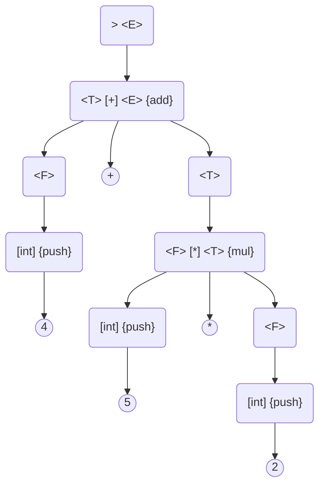

# Grammar

A grammar describes a language via a set of rules which the language follows.
The language has sentences which are sequences of tokens that are accepted by the grammars' rules.

## Tokens

Tokens (terminals) are like the "words" or parts (verbs, nouns) which
make up the language.
Tokens will appear in square brackets (e.g. `[a]`).

The tokenizer will take an input string and break it into tokens.
Those tokens are then passed into the parser which determines
if those tokens are accepted by the grammar for the parser.

In much of this documentation the token will appear as one or more letters.
For example `[a]` is the token for `a` and `[+]` is the token for `+`.
However, tokens can represent more than one letter.
For example `[id]` could be for `apple`, `cat`, or anything matching
the regular expression `[a-zA-Z][a-zA-Z0-9]*`. Another example
could be `[int]` for `0`, `1`, `2456`, or `[0-9]+`.

## Terms

The grammar is made up of terms (nonterminals).
Terms are like phrases in the language.
Terms will appear in angle brackets (e.g. `<A>`).

## Rules

Terms have a collection of rules (productions).
Rules are the right hand side of a `→` or `->`,
with the term the rules belong to on the left hand side.

For example `<A> → [a]` and `<A> → [a] [+] <A>` are both rules on term `<A>`.
These two rules have two tokens used in them `[a]` and `[+]`.
A grammar consisting of term `<A>` with these rules will match the sentences
`a`, `a+a`, `a+a+a`, etc. The language can be expressed as `([+] [a])* [a]`.

To simplify the definition of rules, rules from the same term may be separated
by a bar, `|`. The above example could be described by `<A> → [a] | [a] [+] <A>`.
(This is occasionally shown as a backslash, `/`, in some papers.)

Rules may be empty represented by a lambda (null production), `λ`. For example `<A> → λ`.
(In some papers this is shown as an epsilon `ε` or `∈`,or `Λ`.)

## Prompts

The grammar can have prompts.
Prompts will appear in curly brackets (e.g. `{P}`).

Prompts are unique to Petite Parser so the following is a more detailed
explanation than the explanation for tokens, terms, and rules. For
those other parts there are many many documents online describing them
in high detail.

They prompt for actions to be taken as a specific point in the grammar.
This allows interpretation or compiling without requiring a secondary
tool to traverse a resulting parse tree.

The prompts act like injecting code into the parser, the same as
if the code was written into output code from `ox` or `yacc`.

## Prompt Example \#1

For example, given the following grammar

```plain
> <E>;
<E> -> <T> [-] <E> {sub} | <T> [+] <E> {add} | <T>;
<T> -> <F> [*] <T> {mul} | <F> [/] <T> {div} | <F>;
<F> -> [(] <E> [)] | [int] {push};

# `[int]` is a token for any positive whole number, `[0-9]+`.
```

When the string `4 + 5 * 2` is given it will produce the following tree



The above tree would call the prompts `{push}`, `{push}`, `{push}`, `{mul}`, then `{add}`.

When running the prompts on the tree, the set of prior tokens
to a prompt are able to be referenced by that prompt.
So With the token values interwoven between the prompts it is
`"4"`, `{push}`, `"+"`, `"5"`, `{push}`, `"*"`, `"2"`, `{push}`, `{mul}`, then `{add}`.

Assuming we have a stack of integers. If the prompts were set to perform the following actions:

- `{push}` takes the the prior token value, converted it to from the
  string to actual integer, and pushed it onto a stack
- `{mul}` pops two values from the stack, multiplies them together, and pushes the result to the stack
- `{add}`, `{sub}`, and `{div}` are the same as `{mul}` except they add, subtract, or divide the two values respectively

Then `4 + 5 * 2` would then perform the following:

- push `4` to the stack
- push `5` to the stack
- push `2` to the stack
- pop `2` and `5`, multiply them together, and push `10` to the stack
- pop `10` and `4`, add them together, and push `14` to the stack

As is easily seen, the prompts quickly convert the input strings into commands to perform on the data in that string
without having to understand the parse tree which was produced. Moving the prompts could change this
grammar from postfix notation (Reverse Polish notation) to prefix or some other way of processing the data.

## Prompt Example \#2

Imagine we instead of what was done in [Example #1](#prompt-example-1),
we wanted to convert infix math to a LISP program (like a transpilation).
We can change the prompts in the grammar without changing the language that the grammar describes.

```plain
> <E>;
<E> -> {sub} <T> [-] <E> {close} | {add} <T> [+] <E> {close} | <T>;
<T> -> {mul} <F> [*] <T> {close} | {div} <F> [/] <T> {close} | <F>;
<F> -> [(] <E> [)] | [int] {int};

# `[int]` is a token for any positive whole number, `[0-9]+`.
```

The prompts are defined to do the following:

- `{int}` writes the prior token value as an integer to an output buffer
- `{sub}`, `{add}`, `{mul}`, and `{div}` write `"(- "`, `"(+ "`, `"(* "`, and `"(/ "` respectively to an output buffer
- `{close}` writes `")"` to an output buffer

Passing in `4 + 5 * 2` to the parser will create a parse tree.
Running the prompts on that parse tree will write `"(+ 4 (* 5 2))"` to an output buffer.

With a little additional work on the prompts, inputs like `1 + 2 + 3`, which would output
like `"(+ 1 (+ 2 3))"`, could be outputted as `"(+ 1 2 3)"`.
